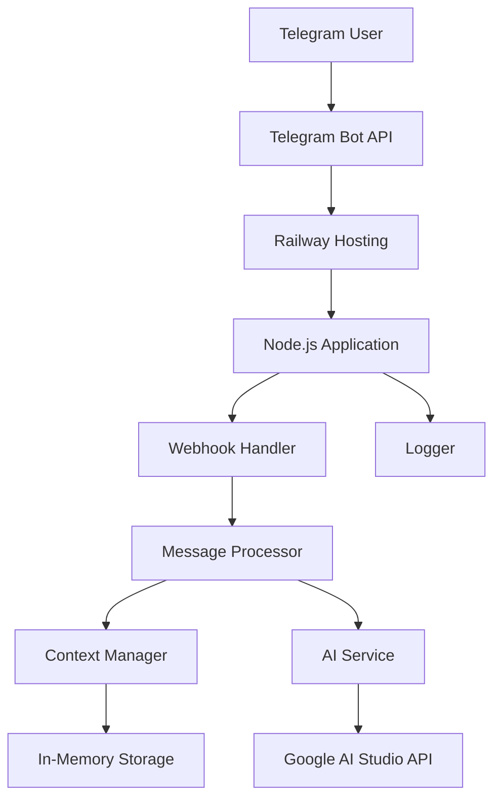

# Design Document

## Overview

Telegram бот с ИИ-ассистентом представляет собой веб-приложение на Node.js, которое использует Telegram Bot API для взаимодействия с пользователями и Google AI Studio (Gemini) для генерации ответов. Приложение будет развернуто на Railway с использованием webhook для получения сообщений от Telegram.

## Architecture



### Архитектурные принципы:
- **Stateless Design**: Основная логика не зависит от состояния сервера
- **Webhook-based**: Использование webhook вместо polling для эффективности
- **Modular Structure**: Разделение на отдельные модули для легкости поддержки
- **Error Resilience**: Graceful handling ошибок и fallback механизмы

## Components and Interfaces

### 1. Bot Controller (`src/bot/botController.js`)
Основной контроллер для обработки входящих сообщений от Telegram.

```javascript
interface BotController {
  handleWebhook(req, res): Promise<void>
  processMessage(message): Promise<void>
  sendMessage(chatId, text): Promise<void>
}
```

### 2. AI Service (`src/services/aiService.js`)
Сервис для взаимодействия с Google AI Studio API.

```javascript
interface AIService {
  generateResponse(prompt, context?): Promise<string>
  isAvailable(): Promise<boolean>
}
```

### 3. Context Manager (`src/services/contextManager.js`)
Управление контекстом разговора для каждого пользователя.

```javascript
interface ContextManager {
  getContext(userId): ConversationContext
  updateContext(userId, message, response): void
  clearContext(userId): void
  cleanupOldContexts(): void
}
```

### 4. Command Handler (`src/handlers/commandHandler.js`)
Обработка специальных команд бота.

```javascript
interface CommandHandler {
  handleStart(chatId): Promise<void>
  handleHelp(chatId): Promise<void>
  handleClear(chatId): Promise<void>
  handleStatus(chatId): Promise<void>
}
```

### 5. Logger (`src/utils/logger.js`)
Система логирования для мониторинга и отладки.

```javascript
interface Logger {
  info(message, metadata?): void
  error(message, error?): void
  warn(message, metadata?): void
}
```

## Data Models

### ConversationContext
```javascript
{
  userId: string,
  messages: Array<{
    role: 'user' | 'assistant',
    content: string,
    timestamp: Date
  }>,
  lastActivity: Date,
  messageCount: number
}
```

### BotMessage
```javascript
{
  messageId: number,
  chatId: number,
  userId: number,
  text: string,
  timestamp: Date,
  isCommand: boolean
}
```

### AIResponse
```javascript
{
  content: string,
  tokensUsed?: number,
  model: string,
  timestamp: Date
}
```

## Error Handling

### 1. API Errors
- **Telegram API errors**: Retry mechanism с exponential backoff
- **AI API errors**: Fallback сообщения при недоступности сервиса
- **Rate limiting**: Graceful handling лимитов API

### 2. Application Errors
- **Webhook validation**: Проверка подлинности запросов от Telegram
- **Input validation**: Валидация входящих сообщений
- **Memory management**: Автоматическая очистка старых контекстов

### 3. Infrastructure Errors
- **Network timeouts**: Настройка таймаутов для всех внешних запросов
- **Server errors**: Health check endpoint для мониторинга
- **Deployment errors**: Graceful shutdown и startup процедуры

## Testing Strategy

### 1. Unit Tests
- Тестирование отдельных компонентов (AI Service, Context Manager)
- Мокирование внешних API для изолированного тестирования
- Покрытие edge cases и error scenarios

### 2. Integration Tests
- Тестирование взаимодействия между компонентами
- Тестирование webhook обработки
- Тестирование полного flow от сообщения до ответа

### 3. Manual Testing
- Тестирование в реальном Telegram окружении
- Проверка различных типов сообщений и команд
- Тестирование производительности и лимитов

## Deployment Configuration

### Environment Variables
```
TELEGRAM_BOT_TOKEN=your_bot_token
GOOGLE_AI_API_KEY=your_gemini_api_key
WEBHOOK_URL=https://your-app.railway.app/webhook
PORT=3000
NODE_ENV=production
LOG_LEVEL=info
```

### Railway Configuration
- **Build Command**: `npm install`
- **Start Command**: `npm start`
- **Health Check**: `/health` endpoint
- **Auto-deploy**: Подключение к GitHub репозиторию

## Security Considerations

1. **Token Security**: Хранение токенов в environment variables
2. **Webhook Validation**: Проверка подлинности webhook запросов
3. **Rate Limiting**: Защита от спама и злоупотреблений
4. **Input Sanitization**: Очистка пользовательского ввода
5. **Error Information**: Не раскрывать чувствительную информацию в ошибках

## Performance Optimization

1. **Caching**: Кеширование частых запросов к AI API
2. **Connection Pooling**: Переиспользование HTTP соединений
3. **Memory Management**: Автоматическая очистка неактивных контекстов
4. **Response Time**: Оптимизация для быстрого ответа пользователям